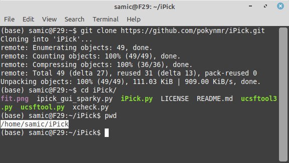
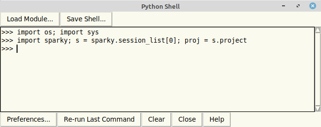
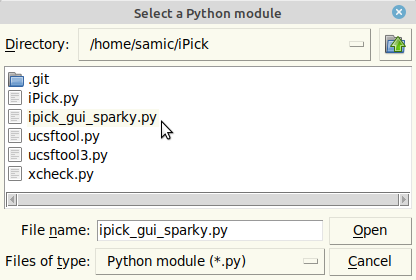
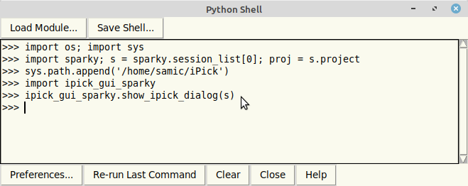

# iPick
Multithreaded Peak Picking Software for UCSF NMR Spectra

_______________________________________________________

## Sparky Module usage

The iPick program is available as a module for the NMRFAM-SPARKY. It is highly recommended that you use the SPARKY module instead of the command line tool. The main reasons are the ease of work and the extended capabilities provided in the module. For example, using the SPARKY module, you can easily select the experiment you are interested in and click a button to perform the peak picking task.
There are also many capabilities built into the module. One example is the newly proposed *Reliability Score* feature that can help a researcher to determine the noise peaks easily.

The module will be integrated into the SPARKY program in near feature which makes starting the program much easier. Until then, you can run the module by following these steps:

Open a Terminal and download the code:

	git clone https://github.com/pokynmr/iPick.git

Please note the directory you downloaded the code in. To find that, you can navigate to the iPick folder:

    cd iPick

and then use the *pwd* command to see the full address:

    pwd

In this case, the full address is */home/samic/iPick*

Then, inside the SPARKY window, open the Python module by typing the two-letter-code *py*

from here, click the *Load Module...* button and navigate to the before-mentioned directory and select the *ipick_gui_sparky.py* file.

Alternatively, you can copy-paste these two commands:

    sys.path.append('/home/samic/iPick')
    import ipick_gui_sparky

(make sure to replace the address inside the single-quotations with the address of the iPick directory on your computer)

Finally, run the module by running this command in the Python module window:

    ipick_gui_sparky.show_ipick_dialog(s)

This will open the iPick window and let you use the module.

_______________________________________________________

## Standalone usage

The iPick program can also be run from the command line.

Here's a simple running example:

python iPick.py --input spectra.ucsf --output peaks.list

There are more options that you can use with the command line script. To see a full list of these options, run the script without any options:

    python iPick.py

Please note that it is highly recommended that you use the SPARKY module instead of the command line tool.

Here is an example of running iPick script:

	python iPick.py -i ~/Ubiquitin_NMRFAM/Spectra/CHSQC.ucsf -o peaks.list -r 1 --threshold 50325.0 --overwrite -c 1
	
In this example, the input file is a CHSQC experiment and the output file (the list of the found peaks) will be named "peaks.list" in the current directory. Also, a threshold of 50325.0 has been defined. The last part of the command, "-c 1", indicates that we want to use only one CPU thread. This number can be increased as needed.

____________________________________________________

## Acknowledgments

#### Citation
The iPick paper is under review and more information will be posted here in future.

#### Contributions
- The ipick.py script was written by Dr. Woonghee Lee (University of Colorado, Denver)
- The iPick Module was written by Dr. Mehdi Rahimi (University of Colorado, Denver)

#### Funding sources

National Science Foundation:

* DBI 1902076 (Lee, W & Markley, J. L.)
* DBI 2051595 (Lee, W & Markley, J. L.)
