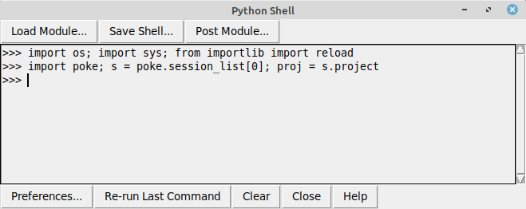

# iPick
Multiprocessing Peak Picking Software for UCSF NMR Spectra

_______________________________________________________

## Introduction

The iPick program is available as a module for the POKY and NMRFAM-SPARKY. It is highly recommended that you use the module instead of the command line tool. The main reasons are the ease of work and the extended capabilities provided in the module. For example, using the module, you can easily select the experiment you are interested in and click a button to perform the peak picking task.
There are also many capabilities built into the module. One example is the newly proposed *Reliability Score* feature that can help a researcher to determine the noise peaks easily.

_______________________________________________________

## Running the iPick module

The module is integrated into the latest version of POKY and NMRFAM-SPARKY programs which makes starting the program much easier. To get the latest version use these links:

To get POKY:  https://poky.clas.ucdenver.edu

To get NMRFAM-SPARKY:  https://nmrfam.wisc.edu/nmrfam-sparky-distribution/

If you are using POKY, you can open the iPick module by using the _two-letter-code_ **iP**.

If you are using NMRFAM-SPARKY, you can open the iPick module by using the _two-letter-code_ **iP**.
Alternatively, you can use the top menu and open "Extensions", from there, navigate to "Peak" menu and find "iPick Peak Picker".

_______________________________________________________

## Downloading and Running the Code

If you want to use the code from this repository, you can run the module by following these steps:

Open a Terminal and download the code:

	git clone https://github.com/pokynmr/iPick.git

Please note the directory you downloaded the code in. To find that, you can navigate to the iPick folder:

    cd iPick

and then use the *pwd* command to see the full address:

    pwd

In this case, the full address is */home/samic/iPick*

Then, inside the POKY or NMRFAM-SPARKY window, open the Python module by typing the two-letter-code **py**

from here, click the *Load Module...* button and navigate to the before-mentioned directory and select the *ipick_gui_sparky.py* file.

Alternatively, you can copy-paste these two commands:

    sys.path.append('/home/samic/iPick')
    import ipick_gui_sparky

(make sure to replace the address inside the single-quotations with the address of the iPick directory on your computer)

Finally, run the module by running this command in the Python module window:

    ipick_gui_sparky.show_ipick_dialog(s)

This will open the iPick window and let you use the module.

_______________________________________________________

## Capabilities

The iPick module had two modes of operation. The _Basic_ mode and the _Advanced_ mode.

A researcher may use the _Basic Mode_ of iPick to quickly pick signals in spectra.
With the _Advanced Mode_ of iPick, one can customize the peak picking options: positive/negative peak selection, base level selection, automatic peak import, and auto-integration by a selected integration mode. Two automated integration modes are available: Individual Fit and Group Fit. The former mode fits each pick individually without considering neighboring peaks, while the latter integrates all peaks considered to be neighbors. Integration Settings (two-letter-code it) specifies different integration protocols, including Gaussian, Lorentzian, Pseudo-Voigt, and viable linewidth ranges.

The Peak List window generated by iPick lists the position, volume, height, S/N, linewidth and Reliability Score (calculated from a linear combination of the volume, S/N, and linewidth) for each detected peak. By clicking the Setup button, the user can add or remove columns from the Peak List Settings window. The weighting factors used calculating the Reliability Score can be manually adjusted from the Manual Coefficients tab. Since the Reliability Score reflects the probability of a peak to be a true signal, the researcher can easily remove false signals (noise and artifact peaks) by specifying a threshold and clicking the Remove button.

The Cross-Validation module provides an alternative way to qualify picked peaks. Noise peaks with the decent reliability score – due to a large SNR or volume because of experimental defects or integration errors – are likely to show up only in a certain spectrum and their resonances will not appear in the other spectra. On the other hand, the resonances of true signals may appear frequently in interrelated spectra. This fact has been used to cross-validate peaks between all spectra.

Each peak will be examined and corresponding peaks in other spectra will be noted. This information will be presented in the Peak list so that the researcher can easily locate lone peak and remove them by clicking the “Remove Lone Peaks” button.

The frequency of the resonances for each peak will be visualized in the Peak Histogram (Figure below) by clicking the Peak Histogram button of the cross-validation window. Less frequently occurring resonances help the user to identify false-positives. It is also possible for the user to view associated histogram bars on the histogram by selecting one or more peaks from the spectral views and clicking the Show the selected peaks button.

_______________________________________________________

## Standalone usage

The iPick program can also be run from the command line.

Here's a simple running example:

python iPick.py --input spectra.ucsf --output peaks.list

There are more options that you can use with the command line script. To see a full list of these options, run the script without any options:

    python iPick.py

Please note that it is highly recommended that you use the POKY or NMRFAM-SPARKY module instead of the command line tool.

Here is an example of running iPick script:

	python iPick.py -i ~/Ubiquitin_NMRFAM/Spectra/CHSQC.ucsf -o peaks.list -r 1 --threshold 50325.0 --overwrite -c 1

In this example, the input file is a CHSQC experiment and the output file (the list of the found peaks) will be named "peaks.list" in the current directory. Also, a threshold of 50325.0 has been defined. The last part of the command, "-c 1", indicates that we want to use only one CPU process. This number can be increased as needed.

_______________________________________________________

## Windows Users

The iPick program runs natively on Mac, Linux and Windows. However, multiprocessing of Python is limited in Windows due to its kernel architecture. To overcome this issue, a user can use WSL2 (Windows Subsystem for Linux):

https://www.windowscentral.com/how-install-wsl2-windows-10

Alternatively, NMRbox.org can be considered. NMRbox provides cloud-based virtual machines for NMR software.

_______________________________________________________

## Acknowledgments

#### Citation
Rahimi, Mehdi, Yeongjoon Lee, John L. Markley, and Woonghee Lee. "iPick: Multiprocessing software for integrated NMR signal detection and validation." Journal of Magnetic Resonance 328 (2021): 106995.
https://doi.org/10.1016/j.jmr.2021.106995

#### Contributions
- The ipick.py script was written by Dr. Woonghee Lee (University of Colorado, Denver)
- The iPick Module was written by Dr. Mehdi Rahimi (University of Colorado, Denver)

#### Funding sources

National Science Foundation:

* DBI 1902076 (Lee, W)
* DBI 2051595 (Lee, W)

University of Colorado Denver
